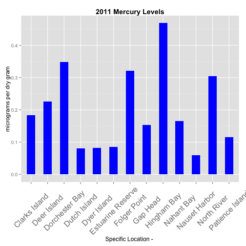

## How Does It Work?
* Select a chemical parameter  
* Select a year between 1986 and 2012   
* Press Submit  

## What Does It Do?  
* The data is searched
* The results are calculated showing you how many records it found.
* A bar graph is plotted to show relative levels by location
* A Google Map is plotted showing the locations.
* The tool tip in the Google Map is calculated to show 
location name and value. 
* A data table is shown and the percentage each value represents
is calculated and shown in the percent column.

---  

## About The Data And Data Processing
* The data the application uses can be found at: 
### NCCOS - National Centers for Ocean and Coastal Science.   

* http://egisws02.nos.noaa.gov/nsandt/index.html#  
* It was downloaded with the *Chemical data set and all parameters for MA and RI*.  
* The data came in two CSV files downloaded.   
* The data was read into, two separate data frames.

* The years range from 1986 to 2012 and it has 285 chemicals covering 63 locations in MA and RI

---  

## About The Data And Data Processing (continued)

```r
x <-read.delim("nccos_chem_data_RI_ALL.txt", stringsAsFactors=FALSE)
y <-read.delim("nccos_chem_data_MA_ALL.txt", stringsAsFactors=FALSE)  
```
* Post loading RI data was at 8945 records and 16 variables.  
* Post loading MA data was at 42487 records and 16 variables.  
* Next we create the location data for google maps and remove NA values and combine them.

```r
x$Loc <- paste(x$Lat_DD, x$Lon_DD, sep=":")
x<- x[!is.na(x$Method) , ]
y$Loc <- paste(y$Lat_DD, y$Lon_DD, sep=":")
y<- y[!is.na(y$Method) , ]
xy <- rbind(x,y)
```
* The consolidated data set is 47755 records and 17 variables.

```r
saveRDS(xy, file='nccos_chem_data_rima.rds')
```
* Saved as an RDS for use by the application.

--- 

## About The Application
* Example Plot
 

* For more..  https://bobfitz.shinyapps.io/Final 


